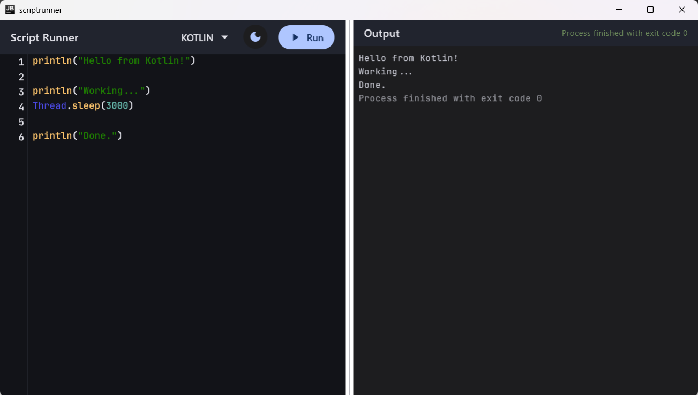
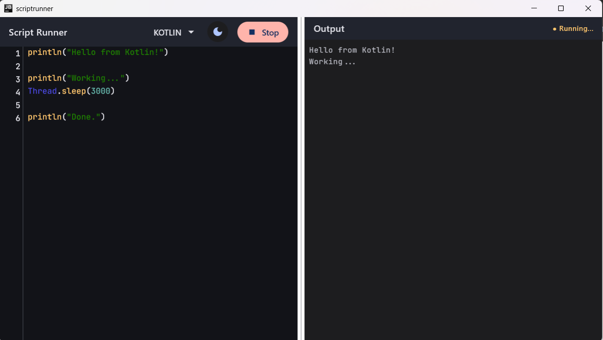
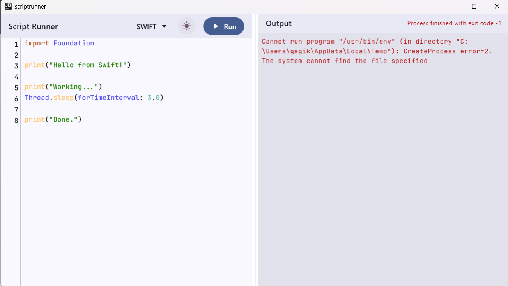
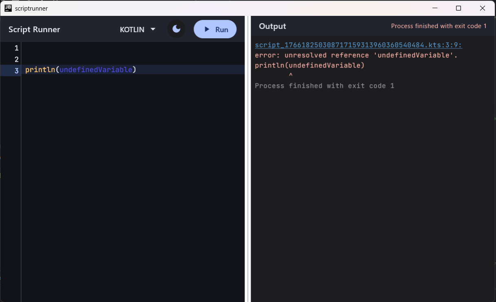
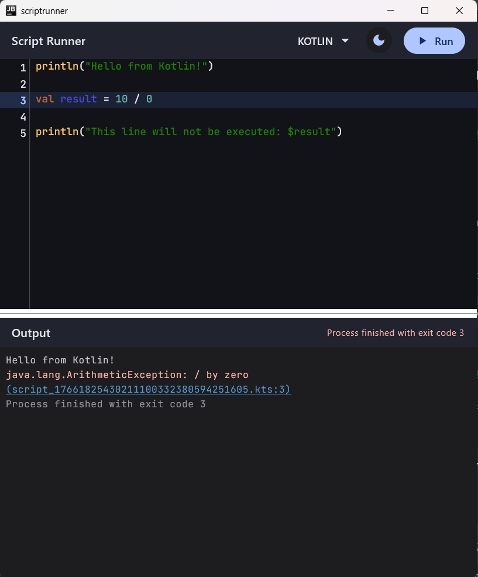

# ScriptRunner

A Kotlin Multiplatform code editor and script execution environment built with Compose Multiplatform.

## Features

- **Syntax highlighting** for Kotlin and Swift
- **Script execution**: Run code in real time with live output
- **Execution indicators**:
    - Running / Finished
    - Exit code (non-zero highlighted)
- **Error navigation**: Clickable errors (e.g., `script:2:1: error: ...`) navigate to the exact line
- **Theme support**: Light and dark modes
- **Responsive layout**: Adaptive split-pane UI

## Script Execution Details

- Supported scripting languages: **Kotlin (.kts)** and **Swift (.swift)**
- The editor content is written to a temporary file:
    - `.kts` for Kotlin scripts
    - `.swift` for Swift scripts
- Scripts are executed using:
    - Kotlin: `kotlinc -script <temp-file>.kts`
    - Swift: `/usr/bin/env swift <temp-file>.swift`
- Execution is performed as a system process on **Desktop (JVM)**
- Supports long-running scripts with live output streaming
- 
## Architecture

The project follows **Clean Architecture** with **MVI (Model-View-Intent)** for the presentation layer.


### Project Structure

```
composeApp/
├── commonMain/
│   ├── domain/           # Use cases, models, repository interfaces
│   ├── data/             # ScriptExecutorImpl (expect/actual)
│   ├── presentation/     # MainViewModel, MainState, MainIntent, MainEffect
│   ├── ui/               # Compose UI components
│   │   ├── theme/        # Colors, dimensions, typography
│   │   ├── editor/       # Code editor, syntax highlighting
│   │   ├── output/       # Console output
│   │   └── components/   # Shared components
│   └── di/               # Koin modules
├── jvmMain/              # Desktop: Real process execution
├── androidMain/          # Android-specific
└── webMain/              # Web: Demo mode (simulated execution)
```

## Tech Stack

- **Kotlin Multiplatform** - Shared business logic across platforms
- **Compose Multiplatform** - Declarative UI framework
- **Koin** - Dependency injection
- **Coroutines & Flow** - Asynchronous programming

## Getting Started

### Prerequisites

- JDK 11 or higher
- Android Studio or IntelliJ IDEA

### Running the Application

**Desktop (JVM)**
```bash
./gradlew :composeApp:run
```

**Web (JS)**
```bash
./gradlew :composeApp:jsBrowserDevelopmentRun
```

**Web (WasmJS)**
```bash
./gradlew :composeApp:wasmJsBrowserDevelopmentRun
```

> Note: The web version runs in demo mode, simulating script execution.


> Note: Script execution is fully supported on **Desktop (JVM)** only.
> Android and Web targets are included to demonstrate Multiplatform architecture.


## Demo

Here are some screenshots showing the editor, script execution, and error handling:





